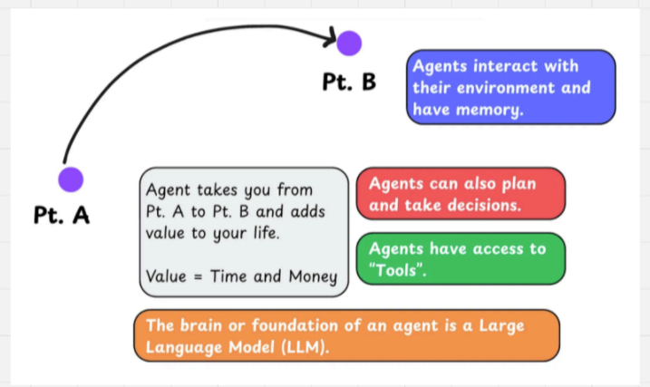
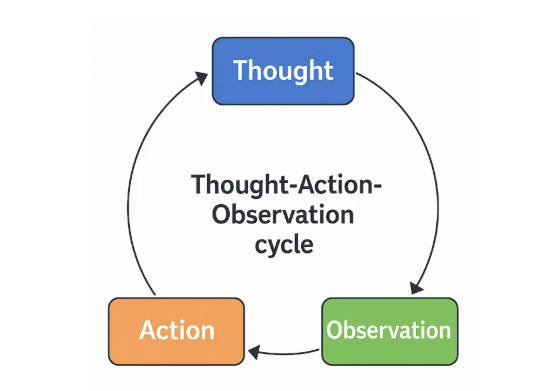
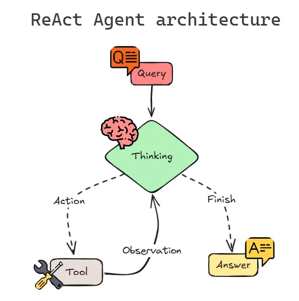
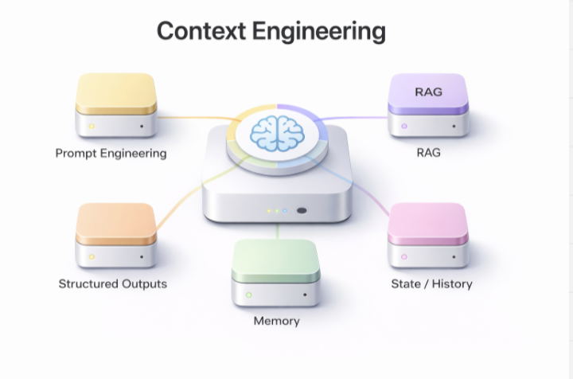
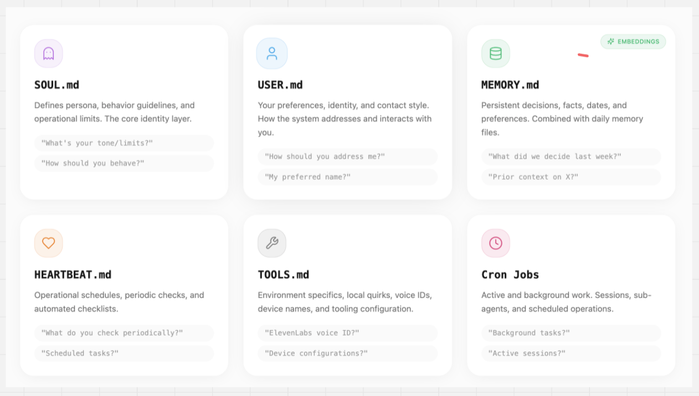
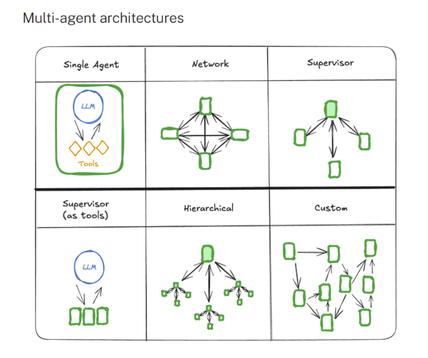
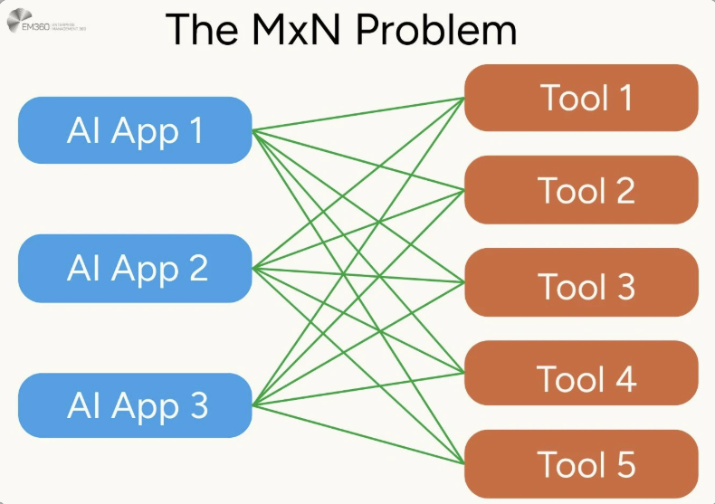
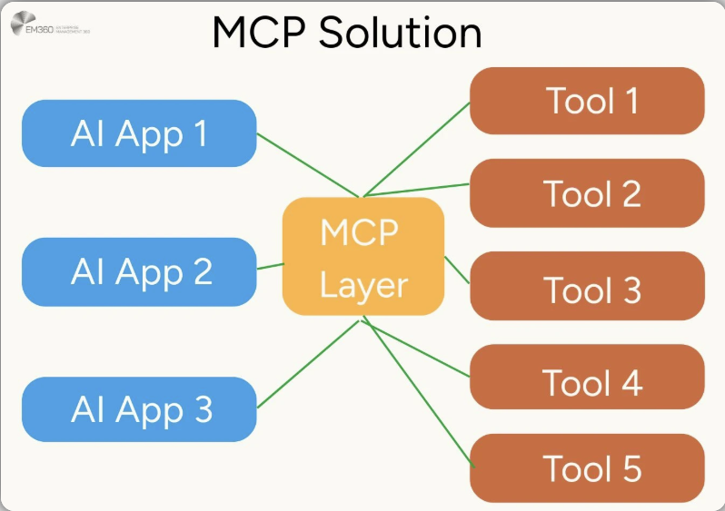

# Les Agents IA et MCP


## 1. Qu'est-ce qu'un agent IA ?

Un **agent IA** est un programme qui utilise un modèle de langage (LLM) pour accomplir une tâche de façon autonome — sans que vous ayez besoin de lui dire étape par étape quoi faire.

La différence fondamentale avec un chatbot classique :

| Chatbot classique | Agent IA |
|---|---|
| Répond à une question | Accomplit une mission complète |
| Réaction unique | Enchaîne plusieurs actions |
| Pas de mémoire entre les étapes | Conserve le contexte et s'adapte |
| Pas d'accès à l'extérieur | Peut utiliser des outils (BDD, web, API...) |



> **En résumé :** un agent vous emmène du point A au point B. Vous lui donnez un objectif, il planifie et agit pour l'atteindre.

---

## 2. Le cerveau de l'agent : le LLM

La **fondation** de tout agent est un **Large Language Model (LLM)** — par exemple GPT, Mistral ou Claude.

Un LLM, à la base, fait une seule chose : **prédire le mot (token) le plus probable après le contexte qu'il reçoit**. C'est une mécanique statistique, entraînée sur des milliards de textes.

```
"La capitale de la France est..." → "Paris"
```

Seul, le LLM répond mais n'agit pas. C'est la couche **agent** autour de lui qui lui donne la capacité d'agir, d'observer et d'apprendre au cours d'une tâche.

---

## 3. Comment l'agent raisonne : la boucle TAO

Le raisonnement d'un agent suit un cycle en trois étapes, appelé **TAO** :



> **T**hought → **A**ction → **O**bservation
> (Pensée → Action → Observation)

```
        ┌─────────────────────────────────┐
        │  🧠 THOUGHT — Pensée            │
        │  Que veut l'utilisateur ?        │
        │  De quelle info ai-je besoin ?   │
        │  Quel outil dois-je utiliser ?   │
        └──────────────┬──────────────────┘
                       │
                       ▼
        ┌─────────────────────────────────┐
        │  ⚡ ACTION — Action             │
        │  Appel d'un outil               │
        │  Requête SQL / recherche web /   │
        │  appel d'API...                  │
        └──────────────┬──────────────────┘
                       │
                       ▼
        ┌─────────────────────────────────┐
        │  👁️ OBSERVATION — Observation   │
        │  Lecture du résultat            │
        │  Est-ce suffisant ?              │◄──────┐
        │  Y a-t-il une erreur ?           │       │ non
        └──────────────┬──────────────────┘       │
                       │ oui                       │
                       ▼                           │
              ✅ Réponse finale      ──────────────┘
```

**Détail de chaque étape :**

**🧠 Thought (Pensée)**

L'agent réfléchit "à voix haute" avant d'agir. Il analyse la demande, identifie ce dont il a besoin et décide quoi faire. Cette étape est interne : l'utilisateur ne la voit pas.

*Exemple de pensée interne :*
> *"L'utilisateur demande la progression de l'élève USER_4521. Je dois interroger la base de données MotherDuck pour obtenir son taux de complétion des quêtes."*

**⚡ Action**

L'agent passe à l'acte. Il appelle concrètement un outil — une requête SQL, une recherche sur le web, un appel à une API externe. C'est la seule étape visible depuis l'extérieur.

**👁️ Observation**

L'agent reçoit et analyse le résultat de son action. Il se pose la question : *"Est-ce que j'ai ce qu'il me faut pour répondre ?"*
- Si **oui** → il formule sa réponse finale
- Si **non** → il repart en **Thought** avec ce nouvel élément en tête

> L'agent **mémorise toutes les étapes** de la boucle en cours. Cela lui permet de ne pas répéter la même action inutilement et de progresser logiquement vers la réponse.


---

## 4. ReAct : enchaîner les boucles pour résoudre un problème complexe

**ReAct** (Reason + Act) est le cadre qui organise **plusieurs boucles TAO** jusqu'à la résolution complète d'un problème.

- **TAO** = une brique élémentaire de raisonnement (une seule itération)
- **ReAct** = la stratégie globale qui enchaîne ces briques jusqu'à la réponse finale

Une tâche complexe nécessite souvent plusieurs boucles TAO successives. 

L'agent alterne sans cesse **raisonnement et action**, en intégrant immédiatement chaque résultat dans sa réflexion.



> **Pourquoi c'est important ?** L'agent s'appuie sur des données réelles vérifiées à chaque étape — pas uniquement sur ce qu'il "croit savoir" depuis son entraînement. Cela réduit fortement les hallucinations.


<video src="Agent_ManimCE_GIF.mp4" controls width="100%"></video>

## 5. Les outils (Tools)

Les **outils** sont ce qui donne à l'agent sa capacité d'agir sur le monde réel. Sans outil, il ne peut que générer du texte.

### Qu'est-ce qu'un outil concrètement ?

Un outil est une **fonction** que l'agent peut déclencher. Chaque outil a :
- un **nom** clair (ex: `search_web`)
- une **description** en langage naturel — c'est grâce à elle que le LLM sait *quand* utiliser cet outil
- des **paramètres** en entrée et un **résultat** en sortie

```python
@tool
def search_web(query: str) -> str:
    """Recherche des informations sur le web.
    Utilise cet outil quand l'utilisateur pose une question
    sur l'actualité ou sur un sujet externe à nos données."""
    return web_search_api(query)
```

### Exemples d'outils courants


    Données
      sql_execute
      read_database
      analyze_results
    Web
      search_web
      fetch_url
    Documents
      search_documents
      read_pdf
    Communication
      send_slack_message
      send_email
    Mémoire
      save_to_memory
      load_from_memory


### Deux façons d'interagir avec le monde : Tool Calling vs Code Execution

Il existe **deux approches fondamentalement différentes** pour qu'un agent agisse sur son environnement.

---

#### Approche 1 — Tool Calling (appel d'outils prédéfinis)

Le LLM ne génère pas de code exécutable. Il génère un **message JSON** décrivant son intention, et c'est le système applicatif qui l'interprète et appelle la bonne fonction.

**Exemple concret — chaîne de raisonnement complète :**

```
🧠 THOUGHT
   "L'utilisateur demande qui n'a pas rendu sa quête cette semaine.
   Je dois interroger la base de données avec l'outil sql_execute."

⚡ ACTION — le LLM génère ce JSON (pas de code, juste une intention) :

   {
     "tool": "sql_execute",
     "parameters": {
       "query": "SELECT user_name FROM quests
                 WHERE status != 'completed'
                 AND week = CURRENT_WEEK()"
     }
   }

   → Le système reçoit ce JSON, appelle la vraie fonction sql_execute(),
     et renvoie le résultat au LLM.

👁️ OBSERVATION
   {
     "result": ["Alice", "Bob", "Carla"]
   }

🧠 THOUGHT
   "J'ai les données. Je peux formuler ma réponse."

✅ RÉPONSE FINALE
   "Cette semaine, 3 élèves n'ont pas rendu leur quête : Alice, Bob et Carla."
```

> Le LLM assure la **partie raisonnement**, le système gère les **actions de façon contrôlée**. Le modèle ne touche jamais directement aux données ni au système.

---

#### Approche 2 — Code Execution (génération et exécution de code)

Dans ce mode, le LLM **écrit lui-même du code** (Python, SQL...) et ce code est exécuté en temps réel dans un environnement dédié appelé **sandbox**.

```
  1. 🧠 LLM raisonne
     → "Je dois analyser ce fichier. Je vais écrire du Python."

  2. 📝 Génère du code
     ┌──────────────────────────────────────┐
     │  import pandas as pd                 │
     │  df = pd.read_csv("data.csv")        │
     │  print(df.describe())                │
     └──────────────────────────────────────┘

  3. 📦 Envoi dans la Sandbox (Docker / container isolé)
     → Environnement sécurisé, coupé du reste du système

  4. ▶️ Exécution du code dans la sandbox

  5. 📊 Output renvoyé au LLM
     ┌──────────────────────────────────────┐
     │  count    50.0                        │
     │  mean     42.3                        │
     │  std       8.1  ...                   │
     └──────────────────────────────────────┘
```

**Qui utilise le Code Execution ?**

| Produit | Implémentation |
|---|---|
| **OpenAI Code Interpreter** (ChatGPT) | Exécute du Python dans une sandbox pour analyser des fichiers, tracer des graphiques |
| **Google Gemini** | Peut générer et exécuter du code pour des calculs complexes |
| **Jupyter AI** | Génère des cellules de code directement dans un notebook |
| **Agents d'analyse de données** | Créent des visualisations, calculent des statistiques à la volée |

**Les risques du Code Execution :**

- 🐛 **Code instable** — erreurs d'import, bibliothèques manquantes, syntaxe incorrecte générée par le modèle
- 🔒 **Sécurité** — le code peut accéder à des fichiers ou données sensibles → risque de fuite (RGPD)
- 🏗️ **Sandbox obligatoire** — nécessite un environnement isolé et maintenu (Docker, container...) coûteux à opérer
- 🔍 **Traçabilité faible** — difficile d'auditer précisément ce que le code a fait sur le système

---

#### Comparaison

| | Tool Calling | Code Execution |
|---|---|---|
| **Ce que le LLM génère** | Un JSON d'intention | Du code Python/SQL |
| **Ce qui s'exécute** | Une fonction prédéfinie et testée | Du code arbitraire |
| **Flexibilité** | Limitée aux outils disponibles | Très élevée |
| **Sécurité** | Haute (actions bornées) | Risquée sans sandbox |
| **Fiabilité** | Haute (outils versionnés) | Variable |
| **Besoin d'une sandbox** | Non | Oui, obligatoire |
| **Cas d'usage** | Production, données sensibles | Analyse exploratoire, prototypes |

> Pour des environnements de production avec des données sensibles, le **Tool Calling est la solution recommandée** : les actions sont bornées, traçables et auditables.

---

## 6. Ce que "voit" l'agent : la fenêtre de contexte

À chaque appel, tout ce que le LLM reçoit tient dans sa **fenêtre de contexte** (context window). C'est sa "mémoire de travail" instantanée — tout ce qu'il sait à cet instant précis.

| Ce qui entre dans la fenêtre de contexte | Description |
|---|---|
| 📝 **User Prompt** | La question ou la demande de l'utilisateur |
| ⚙️ **System Prompt** | Les instructions de comportement de l'agent (invisibles pour l'utilisateur) |
| 💬 **STM** — Short-Term Memory | Historique des échanges récents de la conversation en cours |
| 🗄️ **LTM** — Long-Term Memory | Faits persistants entre les sessions (profil utilisateur, préférences...) |
| 📚 **RAG Data** | Documents pertinents récupérés par recherche vectorielle |
| 🔧 **Tools** | Définitions des outils disponibles (noms, descriptions, paramètres) |
| 📊 **Tool Response** | Résultats des outils appelés pendant cette session |

> Tout ce qui **dépasse** la taille maximale de la fenêtre est **oublié**. Cette limite est physique et propre à chaque modèle (ex: 128 000 tokens pour GPT-4o). C'est pourquoi il faut choisir avec soin ce qu'on y met — c'est tout l'enjeu du Context Engineering.

**Exemple concret — la fenêtre de contexte de ClawdBot :**

```
┌─────────────────────────────────────────────────────────────┐
│                  FENÊTRE DE CONTEXTE — ClawdBot             │
├─────────────────┬───────────────────────────────────────────┤
│ ⚙️  System Prompt │ Instructions : rôle, ton, règles métier   │
├─────────────────┼───────────────────────────────────────────┤
│ 📝  User Prompt  │ "Qui n'a pas rendu sa quête cette semaine?"│
├─────────────────┼───────────────────────────────────────────┤
│ 💬  STM          │ Historique des 8 derniers messages Slack   │
├─────────────────┼───────────────────────────────────────────┤
│ 🗄️  LTM          │ Préférences utilisateur, résumés passés    │
├─────────────────┼───────────────────────────────────────────┤
│ 📚  RAG Data     │ Extrait du process "suivi des quêtes"      │
├─────────────────┼───────────────────────────────────────────┤
│ 🔧  Tools        │ slack_search, sql_execute, web_search, MCP │
├─────────────────┼───────────────────────────────────────────┤
│ 📊  Tool Response│ Résultat SQL : [Alice, Bob, Carla]         │
└─────────────────┴───────────────────────────────────────────┘
```

---

## 7. Context Engineering

Le **Context Engineering**, c'est l'art de remplir intelligemment la fenêtre de contexte du LLM avec les **bonnes informations, au bon moment, dans la bonne quantité**.

> Le Prompt Engineering (écrire un bon prompt) n'en est qu'une toute petite partie. Le Context Engineering, c'est orchestrer **tout** ce qui entre dans la fenêtre de contexte — et décider de ce qui n'y entre pas.



### Le contexte ne commence pas plein — il grossit à chaque étape TAO

C'est là l'idée clé : **le contexte s'accumule progressivement** au fil du raisonnement de l'agent. Au départ, seuls le system prompt et la question de l'utilisateur sont présents. À chaque boucle TAO, de nouvelles informations viennent s'y empiler.

```
🟣 DÉPART
   ⚙️ System Prompt
   📝 User Prompt : "Quels élèves sont en difficulté ?"
   ↓
🔵 + MÉMOIRE injectée
   ⚙️ System Prompt
   📝 User Prompt
   💬 STM — 8 derniers messages de la conversation
   🗄️ LTM — préférences et faits mémorisés
   ↓
🟢 + DOCUMENTS RAG récupérés
   ⚙️ System Prompt  📝 User Prompt
   💬 STM  🗄️ LTM
   📚 Chunk 1 — "Définition d'un élève en difficulté"
   📚 Chunk 2 — "Process de suivi pédagogique"
   ↓
🟡 + OUTILS disponibles
   ⚙️ System Prompt  📝 User Prompt
   💬 STM  🗄️ LTM  📚 RAG
   🔧 Tool défini : sql_execute(query: str)
   🔧 Tool défini : search_web(query: str)
   ↓
🟠 + RÉSULTATS des outils (Observations TAO)
   ⚙️ System Prompt  📝 User Prompt
   💬 STM  🗄️ LTM  📚 RAG  🔧 Tools
   📊 Observation 1 — résultat SQL : [Alice 42%, Bob 38%]
   📊 Observation 2 — résultat SQL retards : [Alice 3, Bob 4]
   ↓
✅ RÉPONSE FINALE générée à partir de tout ce contexte accumulé
```

À chaque observation dans la boucle TAO, le résultat s'ajoute au contexte. Le LLM au prochain appel "voit" tout ce qui s'est passé avant — c'est ce qui lui permet de raisonner de façon cohérente sur plusieurs étapes.

### Les questions que ça soulève : combien mettre dans chaque partie ?

C'est là que le Context Engineering devient un vrai sujet d'optimisation. Chaque couche a un **coût en tokens** — et trop de contexte nuit autant que pas assez.

| Composante | Trop peu | Trop | Bonne pratique |
|---|---|---|---|
| **RAG** | L'agent manque d'info, hallucine | L'agent se noie, répond à côté | 3 à 5 chunks les plus proches |
| **STM** (historique) | L'agent "oublie" le fil de la conversation | Le contexte explose en tokens | 5 à 10 derniers messages |
| **LTM** | L'agent ne connaît pas l'utilisateur | Informations obsolètes ou hors sujet | Résumés synthétiques, faits clés uniquement |
| **Tools** | L'agent ne sait pas quoi utiliser | L'agent se trompe d'outil (trop de choix) | Seulement les outils pertinents au contexte |
| **System Prompt** | Comportement incohérent | Instructions contradictoires | Clair, ciblé, sans redondance |

### Les composantes du Context Engineering


> **Règle d'or :** chaque token dans le contexte a un coût — en argent, en vitesse, et en attention du modèle. Un contexte bien construit = réponses plus pertinentes + agent plus rapide + facture API moins élevée.

---

## 8. La mémoire de l'agent

Un agent peut gérer plusieurs types de mémoire, qui correspondent chacun à un besoin différent :

| Type | Signification | Contenu | Implémentation concrète |
|---|---|---|---|
| **STM** | Short-Term Memory — mémoire de la conversation en cours | Historique des derniers messages échangés | Liste de messages Python passée au LLM dans le contexte |
| **LTM** | Long-Term Memory — mémoire persistante entre les sessions | Faits sur l'utilisateur, préférences, résumés passés | Base de données PostgreSQL, Redis, fichier JSON |
| **Sémantique** | Mémoire des documents et connaissances (RAG) | Chunks de documents vectorisés, recherchés par similarité | ChromaDB, Pinecone, Weaviate |
| **Procédurale** | Savoir-faire de l'agent — comment il doit se comporter | Instructions de rôle, règles métier, ton, format de réponse | System prompt de l'agent |

**Exemple concret — les mémoires de ClawdBot :**

ClawdBot implémente ces 4 types de mémoire via **6 fichiers dédiés**, chargés dans le contexte à chaque session :



| Fichier | Type de mémoire | Contenu |
|---|---|---|
| **SOUL.md** | Procédurale | Personnalité, comportement, règles d'identité de l'agent |
| **USER.md** | LTM | Préférences, nom, style de communication de l'utilisateur |
| **MEMORY_.md** | LTM | Faits persistants, décisions passées, dates importantes |
| **HEARTBEAT.md** | Procédurale | Tâches périodiques, vérifications planifiées |
| **TOOLS.md** | Procédurale | Config des outils, noms des services, variables d'environnement |
| **Cron Jobs** | STM / procédurale | Tâches actives en arrière-plan, agents planifiés en cours |

---

## 9. Les bibliothèques : LangChain et LangGraph

Plutôt que de tout coder from scratch, des bibliothèques Python facilitent grandement la création d'agents.

### LangChain

**LangChain** est le framework de référence pour construire des applications avec des LLMs. Il fournit des briques prêtes à l'emploi, il permet de connecter un LLM à des outils, de la mémoire et des documents en quelques lignes de code, sans réinventer la roue.

### LangGraph

**LangGraph** est une extension de LangChain pour aller plus loin : créer des **systèmes multi-agents** avec des flux non linéaires (boucles, conditions, retours en arrière).

Là où LangChain pense en "chaîne" (A → B → C), **LangGraph pense en graphe** — les agents peuvent se déléguer des tâches, relancer une recherche, ou choisir différents chemins selon le résultat.

#### Les architectures multi-agents possibles

LangGraph permet 6 architectures différentes selon la complexité du problème :



| Architecture | Principe |
|---|---|
| **Single Agent** | Un seul LLM avec plusieurs outils — suffisant pour la plupart des cas simples |
| **Network** | Plusieurs agents qui communiquent librement entre eux (peer-to-peer) |
| **Supervisor** | Un agent principal qui reçoit la demande et délègue à des agents spécialisés |
| **Supervisor (as tools)** | Variante : le superviseur traite les sous-agents comme des outils appelables |
| **Hierarchical** | Plusieurs superviseurs imbriqués — pour des domaines très distincts |
| **Custom** | Flux libre en graphe — pour des cas métier très spécifiques |

> La plupart des projets commencent en **Supervisor** (simple et contrôlé) et évoluent vers **Hierarchical** lorsque le nombre d'agents et de domaines augmente.

---

## 10. MCP : le protocole universel

### Le problème avant MCP

Avant MCP, chaque équipe devait coder ses propres intégrations entre un LLM et ses outils. Résultat : des dizaines de connecteurs sur-mesure, tous différents, difficiles à maintenir.

**N × M outils = N×M intégrations à créer et maintenir.**



### La solution : MCP comme l'"USB-C de l'IA"

MCP (Model Context Protocol), créé par **Anthropic en novembre 2024**, est un **protocole standardisé** qui définit une seule façon universelle pour un LLM de communiquer avec n'importe quel outil ou source de données.



**Une seule façon de faire = un serveur MCP créé une fois, utilisable par tous les LLMs compatibles.**

### Mais c'est quoi concrètement un "serveur MCP" ?

Un **serveur MCP** est un **programme qui tourne sur votre machine locale**. Il fait le pont entre votre agent IA et un outil externe (Slack, GitHub, une base de données...).

Voici ce qui se passe en pratique :

```
  1. Slack (ou GitHub, ou Notion...) a écrit et publié son serveur MCP
     → disponible sur GitHub, prêt à télécharger

  2. Vous le téléchargez et le lancez sur votre machine
     → le serveur MCP de Slack tourne en local sur votre ordi

  3. Votre agent IA (le MCP Client) se connecte à ce serveur
     → il lui demande : "qu'est-ce que tu sais faire ?"

  4. Le serveur répond : "je sais envoyer des messages, lire des channels,
     faire des recherches dans l'historique Slack"

  5. L'agent peut maintenant utiliser ces capacités comme s'il s'agissait
     de ses propres outils
```

> C'est exactement comme installer un driver pour une imprimante : l'imprimante expose ce qu'elle sait faire, votre système peut l'utiliser. L'éditeur publie le driver une fois — tout le monde peut s'en servir.

### Qui adopte MCP ?

MCP est en train de devenir un standard de facto dans l'industrie — mais pas encore universellement adopté :

```mermaid
    MCP["🔌 Standard MCP"]

    MCP -->|"✅ Créateur"| AN["Anthropic\n(Claude)"]
    MCP -->|"✅ Adopté"| MI["Mistral AI"]
    MCP -->|"✅ Adopté"| GG["Google\n(Gemini)"]
    MCP -->|"✅ Adopté"| MS["Microsoft\n(Copilot)"]
    MCP -->|"⚠️ Standard concurrent"| OA["OpenAI\n(ChatGPT)\nPropose son propre\nstandard : 'Agents SDK'"]
```

MCP a de bonnes chances de s'imposer grâce à son adoption rapide, mais la fragmentation du marché reste un enjeu.

### Les 3 concepts clés de MCP

Un serveur MCP peut exposer trois types de ressources à un LLM :

| Type | Ce que c'est | Exemples |
|---|---|---|
| **🔧 Tools** | Fonctions que le LLM peut déclencher | Envoyer un message Slack, exécuter une requête SQL, créer un ticket |
| **📁 Resources** | Données que le LLM peut lire | Fichiers, contenu de pages, résultats de BDD |
| **💬 Prompts** | Templates de prompts réutilisables fournis par le serveur | Instructions pré-écrites pour des tâches courantes |

### Les méthodes MCP (comment ça communique ?)

Le protocole définit un dialogue standardisé entre le client (votre agent) et le serveur :

```
  Agent → Serveur MCP Slack :   "initialize"
  Serveur → Agent :              "Bonjour, voici ce que je sais faire"

  Agent → Serveur :              "tools/list — quels outils as-tu ?"
  Serveur → Agent :              ["send_message", "read_channel", "search_messages"]

  Agent → Serveur :              "tools/call — send_message(channel='#general', text='Hello')"
  Serveur → Agent :              "Message envoyé ✓"

  Agent → Serveur :              "resources/list — quelles données peux-tu me donner ?"
  Serveur → Agent :              ["#general", "#random", "#dev"]

  Agent → Serveur :              "resources/read — donne-moi #general"
  Serveur → Agent :              "Derniers messages du channel..."
```

| Méthode | Rôle |
|---|---|
| `initialize` | Démarrer la connexion, échanger les capacités disponibles |
| `tools/list` | Demander la liste des outils disponibles sur le serveur |
| `tools/call` | Exécuter un outil spécifique avec ses paramètres |
| `resources/list` | Demander la liste des ressources disponibles |
| `resources/read` | Lire le contenu d'une ressource |

### Qui crée des serveurs MCP ?

L'écosystème grandit très rapidement :
- **Anthropic** — serveurs officiels (filesystem, GitHub, Slack, PostgreSQL, Brave Search...)
- **Éditeurs de logiciels** — Notion, Linear, Figma, Atlassian proposent leurs propres serveurs
- **La communauté open source** — des centaines de serveurs disponibles sur GitHub
- **Vous !** — n'importe qui peut créer un serveur MCP en Python ou TypeScript

---

## Récapitulatif


| Concept | En une phrase |
|---|---|
| **LLM** | Le moteur de raisonnement, entraîné à prédire du texte |
| **Boucle TAO** | Thought → Action → Observation, la brique élémentaire de tout agent |
| **ReAct** | Enchaîner plusieurs boucles TAO jusqu'à résoudre une tâche complexe |
| **Tool** | Une fonction que l'agent peut appeler pour agir sur le monde réel |
| **Tool Calling** | Le LLM génère un JSON d'intention, le système exécute l'action (sécurisé) |
| **Code Execution** | Le LLM génère du code exécuté dans une sandbox (flexible mais risqué) |
| **Context Window** | Tout ce que le LLM "voit" à un instant T |
| **Context Engineering** | L'art de construire un contexte optimal pour le LLM |
| **STM** | Short-Term Memory — mémoire de la conversation en cours |
| **LTM** | Long-Term Memory — mémoire persistante entre les sessions |
| **LangChain** | Framework pour connecter LLMs, outils et mémoire |
| **LangGraph** | Extension pour orchestrer des agents en graphe non linéaire |
| **MCP** | Protocole standard pour connecter un LLM à n'importe quel outil externe |
